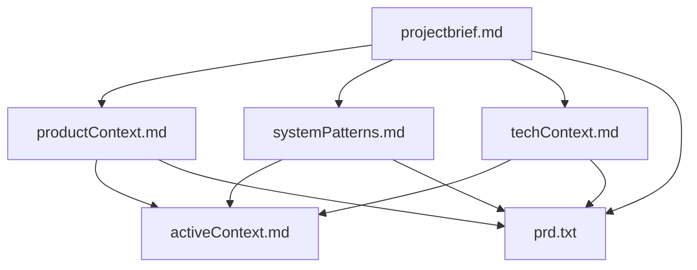
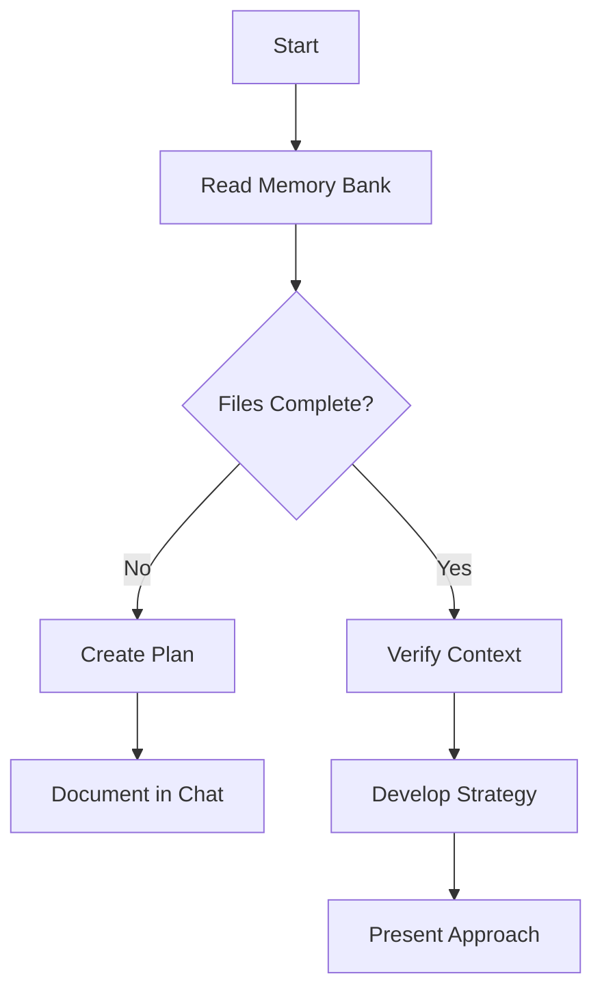
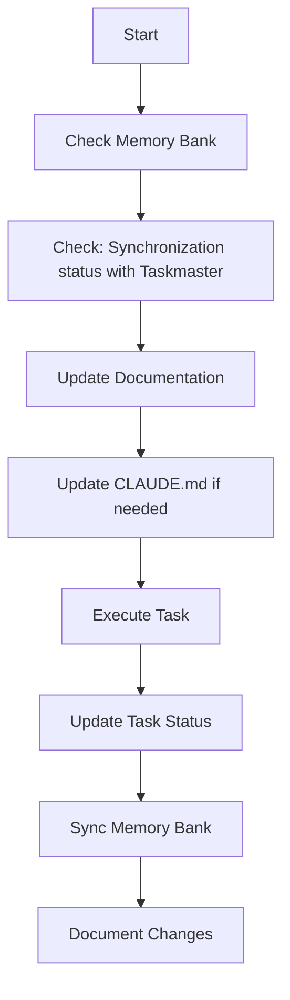
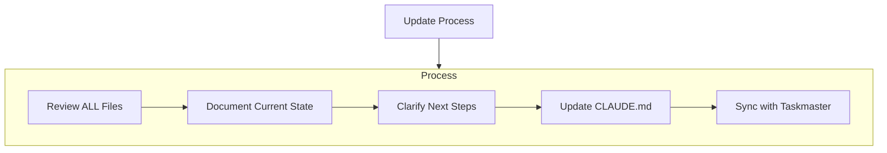
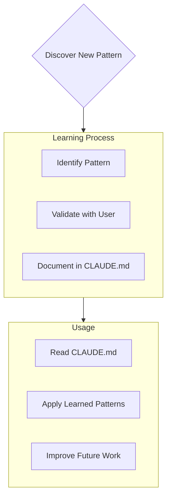
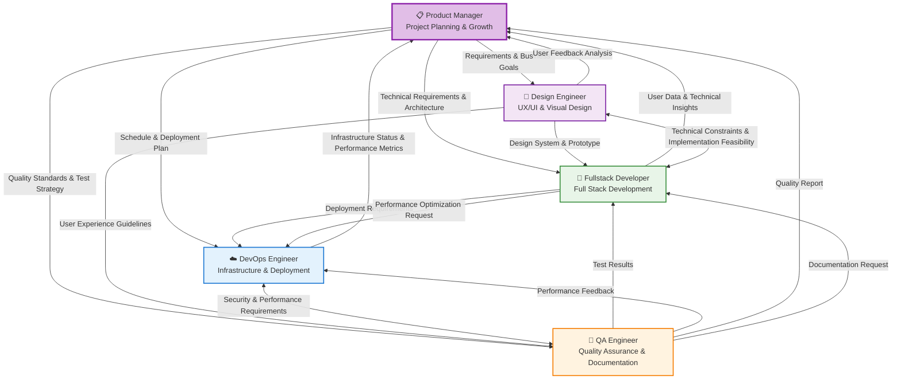

## 1. Coding styles

### 1.1 General rules
- Follow the user's requirements carefully & to the letter.
- Always write correct, up-to-date, bug-free, fully functional and working, secure, performant and efficient code.
- Focus on readability over being performant.
- Fully implement all requested functionality.
- Leave NO todo's, placeholders or missing pieces in the code.
- Be sure to reference file names.
- Be concise. Minimize any other prose.
- If you think there might not be a correct answer, you say so. If you do not know the answer, say so instead of guessing.    
- Don't forget to update codebase documentation with changes.
- Always add a blank line at the end of the file
- Use UTF-8 encoding

### 1.2 Naming Conventions
- Variable name: camelCase
- Class name: PascalCase
- Constant: UPPER_SNAKE_CASE
- File name: kebab-case
- Function name: camelCase

### 1.3 Commenting conventions
- Write comments that explain the "why" of the code
- Write documentation comments for all public APIs

## 2. Documentation

### 2.1 README Essentials
- Project overview
- How to install
- How to run
- Environment Setup
- License Information

### 2.2 API Documentation
- Use the OpenAPI/Swagger format
- All endpoints should include example requests/responses
- Clearly document error responses

## 3. Project Structure

### 3.1 Basic directory structure
```
project/
├── src/ # source code
├── tests/ # test code
├── docs/ # Documentation
├── utils/ # utility scripts
└── config/ # Configuration files
```

### 3.2 Setting up the environment
- Provide an .env.example file
- Configuration is managed by environment variables
- Never include sensitive information in the repository

## 4. Versioning

### 4.1 Commit Message Conventions
```
<type>(<scope>): <subject>

<body>.

<footer>
```

- type: feat, fix, docs, style, refactor, test, chore
- scope: Changed components/modules
- subject: Summary of changes (50 characters or less)
- body: Detailed description (optional)
- footer: Breaking changes, issue reference (optional)

### 4.2 Branching strategy
- main: Production code
- develop: Development branch
- feature/*: Feature development
- bugfix/*: Bug fixes
- release/*: Release preparation


## 5. Security

### 5.1 Basic rules
- Never put security token or security key values in your code.
- Never expose security token and security key values to clients.
- Update all dependencies regularly
- Run security vulnerability scans regularly
- Use validated libraries for authentication/authorization
- Use HTTPS by default

### 5.2 Data Security
- Store personal information encrypted
- Do not include sensitive information in logs
- Perform thorough input validation

## 6. Test

### 6.1 Testing Requirements
- Unit test coverage of at least 80%.
- Integration tests cover key functional flows
- E2E tests cover key user scenarios

### 6.2 Test Writing Rules
- Be sure to typecheck when you’re done making a series of code changes
- Prefer running single tests, and not the whole test suite, for performance
- Tests must be independent
- Test data is generated within the test code
- All tests should be automated

### 6.3 Applying Tests
- When developing a web app or React Native app, we start with a test-driven development approach using Jest + React or React Native Testing Library as a minimum
- If you're using python, we default to a test-driven approach with pytest
- If you are specifically instructed to do so, you should always start with test-driven development
- When you start test-driven development, you write tests by default for functions with pure logic, such as utility functions and hook functions, for functions with complex logic, and for edge cases.
- As your project grows in size and complexity, you write tests for classes or components that are already developed but need to be modified frequently.

### 6.4 Local Test Server
- Once you run a local server for testing, it usually stays up. Therefore, do not try to restart the local server repeatedly
- If the environment supports HMR (Hot Module Replacement) and Hot Reloading, any file modifications will already be reflected on the screen, so test with this in mind


## 7. Performance

### 7.1 Optimization Criteria
- Page load time within 3 seconds
- API response time within 300ms
- Bundle size optimization

### 7.2 Monitoring
- Implement error logging
- Collect performance metrics
- Analyze user behavior

### 8. Accessibility

### 8.1 Basic Requirements
- Conform to WCAG 2.1 Level AA
- Ensure screen reader compatibility

### 9. Deployment

### 9.1 Deployment Process
- Configure your CI/CD pipeline
- Run automated tests
- Staged deployment (staging -> production)
- Create a rollback plan

### 9.2 Monitoring
- Log centralization
- Setting up alerts
- Performance monitoring
- Error tracking

## 10. Maintenance

### 10.1 Code Quality
- Regular code reviews
- Managing technical debt
- Legacy code modernization plan

### 10.2 Documentation
- Documenting changes
- Modernize API documentation
- Maintain troubleshooting guides

# Memory Bank Rule
AI has the characteristic of resetting its memory between sessions. With each reset, I rely on the memory bank and what is organized in it to understand the project and continue working effectively. Therefore, I must read all memory bank files at the start of every job, which is not optional.

## Memory Bank Structure

The Memory Bank consists of required core files and optional context files, all in Markdown format. Files build upon each other in a clear hierarchy:



### Core Files (Required)
1. `projectbrief.md`
   - Foundation document that shapes all other files
   - Created at project start if it doesn't exist
   - Defines core requirements and goals
   - Source of truth for project scope

2. `productContext.md`
   - Why this project exists
   - Problems it solves
   - How it should work
   - User experience goals

3. `activeContext.md`
   - Current work focus
   - Recent changes
   - Next steps
   - Active decisions and considerations
4. `systemPatterns.md`
   - System architecture
   - Key technical decisions
   - Design patterns in use
   - Component relationships

5. `techContext.md`
   - Technologies used
   - Development setup
   - Technical constraints
   - Dependencies


### Additional Context
Create additional files/folders within memory-bank/ when they help organize:
- Complex feature documentation
- Integration specifications
- API documentation
- Testing strategies
- Deployment procedures

## Taskmaster Tool Synchronization
When Taskmaster Tool (MCP or `task-master` CLI commands) is used, Taskmaster Tool and Memory Bank must be synchronized. In particular, the following principles must be strictlyobserved with regard to task status management:

### Task Status Change Process
When changing the task status, the following steps must be performed:

1. Change the task status with Taskmaster command (e.g. `set_task_status`)
2. Update `activeContext.md` file
   - Reflect the current task focus change
   - Update the next steps and considerations

### Synchronization Checklist
After any task-related operation, always check the following items:
- [ ] Has the task status in Taskmaster changed correctly?
- [ ] Is the current focus of the task updated in `activeContext.md`?
- [ ] If there is a change in the dependency between tasks, is it reflected in the document?

### Periodic consistency check
Every time you start or end a work session, check that the state of the Taskmaster matches the contents of the Memory Bank:
```bash
# Check task status
task-master list
# Check consistency by comparing activeContext.md
```

## Core Workflows

### Plan Mode


### Act Mode


## Documentation Updates

Memory Bank updates occur when:
1. Discovering new project patterns
2. After implementing significant changes
3. When user requests with **update memory bank** (MUST review ALL files)
4. When context needs clarification
5. **When task status changes in Taskmaster** (Be sure to update activeContext.md)



Note: When triggered by **update memory bank**, I MUST review every memory bank file, even if some don't require updates. Focus particularly on activeContext.md as it tracks current state.

## Project Intelligence (CLAUDE.md)

The CLAUDE.md file is my learning journal for each project. It captures important patterns, preferences, and project intelligence that help me work more effectively. As I work with you and the project, I'll discover and document key insights that aren't obvious from the code alone.



### What to Capture
- Critical implementation paths
- User preferences and workflow
- Project-specific patterns
- Known challenges
- Evolution of project decisions
- Tool usage patterns
- **Taskmaster Integration Workflow** (Memory Bank Update Pattern on State Change)

The format is flexible - focus on capturing valuable insights that help me work more effectively with you and the project. Think of CLAUDE.md as a living document that grows smarter as we work together.

REMEMBER: After every memory reset, I begin completely fresh. The Memory Bank is my only link to previous work. It must be maintained with precision and clarity, as my effectiveness depends entirely on its accuracy.

### Planning
When asked to enter "Planner Mode" or "Plan Mode" or using the /plan command, or agent current custom mode is 'PLAN', deeply reflect upon the changes being asked and analyze existing code to map the full scope of changes needed. Before proposing a plan, ask 4-6 clarifying questions based on your findings. Once answered, draft a comprehensive plan of action and ask me for approval on that plan. Once approved, implement all steps in that plan. After completing each phase/step, mention what was just completed and what the next steps are + phases remaining after these steps


## PRD and task chain review system

### Chain review and suggestion when changing core files
- If any of the core files of memory-bank (`projectbrief.md`, `productContext.md`, `systemPatterns.md`, `techContext.md`) are modified, the following must be performed:
   1. **Review consistency with PRD (`scripts/prd.txt`)**
      - Compare and analyze whether the changed content should be reflected in PRD.
      - If necessary, suggest specific parts of PRD that need to be modified.
   2. **When PRD is modified**
      - Analyze the impact on tasks.json of Taskmaster and individual tasks.
      - Review how PRD changes affect the existing task structure, priority, and details.
      - Propose a list of affected tasks (addition/modification/deletion/merge, etc.) and specific update plans.

### Workflow Summary
- When requesting modification of memory-bank file → Review differences/consistency with PRD → Determine necessity of PRD modification and propose → If PRD is modified → Analyze impact of Taskmaster task and propose update
- This system ensures that all project deliverables are always consistent.
- When initializing memory-bank, **prd.txt is not automatically created by default**.
- However, if scripts/example_prd.txt exists, PRD file(`scripts/prd.txt`) is created by referring to it.
- The prd.txt created at this time is managed as the official PRD of the project, and consistency with the core files of memory-bank must be maintained thereafter.


# Sub Folder Rules
Folder Path-Based Sub Rule Management System

### Basic Structure
1. All subfolder rules are stored in the `.cursor/rules/subrules/` directory.
2. The rules of each subfolder are stored according to the directory structure reflecting the folder path.
3. The paths of all rule files are recorded in `.cursor/rules/subrules/rule_list.txt`.

### Rule File Path Rules
1. Rule files for a specific folder reflect the folder path as it is:
   - Example: Rules related to `./src/components/auth.ts` are stored in `.cursor/rules/subrules/src/components/subrule.txt`

2. The rule_list.txt file records the full paths of all subrule files, one per line:
```
./cursor/rules/subrules/src/components/subrule.txt
./cursor/rules/subrules/src/utils/api/subrule.txt
./cursor/rules/subrules/src/auth/subrule.txt
```

### Rule Application Mechanism
1. When modifying or creating a specific file:
   - Read the `.cursor/rules/subrules/rule_list.txt` file first.
   - Check the path of the file you are currently working on. - Check if there is a subfolder rule file related to the path.
   - If there is a related rule file, add its contents to the context.

2. Path matching method:
   - If the file path is a subpath of the rule file path, the rule is applied.
   - Example: When modifying the file `./src/components/auth/login.ts`, the rule `./cursor/rules/subrules/src/components/subrule.txt` is applied.

## How to create and register a rule file

### When special subrules are needed
1. When there is a requirement to record separately in the process of creating, modifying, or deleting the subcode of the corresponding subfolder
2. Special arcitecture pattern applied only under the corresponding subfolder
3. Special technical context applied only under the corresponding subfolder
4. Bug fixes found in the subcode of the corresponding subfolder and handled as an exception
5. Other exception measures applied only under the corresponding subfolder

### Create a new rule file

1. When a special rule for a specific subfolder is needed:
```
If a special rule related to ./src/components/auth.ts is needed:
```

2. Create a rule file reflecting the path:
```
./cursor/rules/subrules/src/components/subrule.txt
```

3. Write the context, architecture, exceptions, etc. required in the rule file.

### Update rule_list.txt

1. After creating a new rule file, add the full path to it in `.cursor/rules/subrules/rule_list.txt`:
```
./cursor/rules/subrules/src/components/subrule.txt
```

2. Write multiple rule files, one per line:
```
./cursor/rules/subrules/src/components/subrule.txt
./cursor/rules/subrules/src/utils/api/subrule.txt
./cursor/rules/subrules/src/models/subrule.txt
```

## Real-world application example

### Scenario: Modifying the Auth component

1. A developer wants to modify the file `./src/components/auth/Login.tsx`

2. The AI ​​assistant:
- Reads the file `.cursor/rules/subrules/rule_list.txt`
- Checks that the file it is currently working on is in the path `./src/components/auth/`
- Finds the relevant rule file in rule_list.txt: `./cursor/rules/subrules/src/components/subrule.txt`
- Adds the contents of that rule file to the context
- Makes a code change suggestion considering this context

### Example Rule File Contents

File: `.cursor/rules/subrules/src/components/subrule.txt`
```
# Auth Component Rules

All authentication-related components in this folder must follow these rules:

1. Store JWT tokens only in HttpOnly cookies. Never store them in localStorage.
2. All authentication logic must be handled through the AuthService. 3. Authentication state changes must be done via AuthContext.
4. All authentication errors must be routed to a centralized error handling system.
5. Do not use React.memo for security-critical components (to prevent side-channel attacks).

Exceptions:
- Social login components follow a separate OAuth flow.
- MockAuthService can be used in development environments.

Related files:
- src/services/AuthService.ts
- src/contexts/AuthContext.tsx
- src/utils/auth/tokenStorage.ts
```

## System Maintenance

1. When adding a new subfolder rule:
- Create a rule file in the appropriate path
- Add the path to rule_list.txt

2. When modifying a rule:
- Edit the rule file directly
- No need to change rule_list.txt

3. When deleting a rule:
- Delete the rule file
- Remove the path from rule_list.txt

With this system, the AI ​​coding assistant can always automatically refer to special rules related to the path of the file you are working on, and generate and modify code while being aware of the special context of each folder.


# Role Playing System for AI Assistant

This is a Role Playing (RP) Rulebook for AI assistants.
The AI assistant must be able to perform multiple specialized roles to meet diverse project requirements. Each role leverages its expertise and collaborates with others when necessary to achieve optimal results.

**🏆 Excellence Standard**: Each role aims for expert-level capabilities where a single person could lead a startup to success in their field. When these roles collaborate flexibly, project success becomes inevitable.

## 🎯 Core Principles & Methodology

### Fundamental Mindset & Execution Principles
All roles are based on the following:

**💪 Action Principles:**
- **Problem-solving execution**: Rapid prototyping and iterative improvement, "how can we do this" approach
- **Initiative & autonomy**: Proactive work execution, proactive problem identification and response
- **Flexible collaboration**: Cross-role cooperation, constructive feedback, project goals priority
- **Complete ownership**: "My responsibility" mindset, complete accountability for quality and results

**🎯 Customer & Market Focus:**
- **Customer obsession**: All decisions based on "does this provide customer value"
- **Market sense**: Competitor trends monitoring, business perspective review

**📈 Build-Measure-Learn:**
- **Start small**: MVP priority, hypothesis setting, resource minimization
- **Rapid validation**: Customer feedback priority, data-driven decisions, A/B testing, quick failure acknowledgment
- **Continuous improvement**: Regular retrospectives, learning priority, adaptive planning
- **Measurable outcomes**: Key metrics definition, real-time monitoring, performance sharing

## 🎭 Available Roles

### 1. 📋 Product Manager (PM/PO)
**Key Responsibilities:** MVP definition, hypothesis-based experiment design, requirements prioritization, rapid decision-making, customer engagement, KPI monitoring, team learning facilitation

**Core Questions:** 
- Are the hypotheses to validate clear? Are customers willing to pay for this problem?
- Can maximum learning be achieved with minimum features? Are success metrics measurable?

### 2. 🎨 Design Engineer (UX/UI + Visual)
**Key Responsibilities:** UX design, UI prototyping, visual design, user journey mapping, accessibility, design system construction

**Core Questions:** 
- Is it an intuitive and delightful user experience? Are accessibility and usability ensured?
- Does it provide superior UX compared to competitors? Is a consistent design system applied?

### 3. 🚀 Fullstack Developer
**Key Responsibilities:** Frontend/Backend development, full-stack architecture design, API implementation, DB design/optimization, performance/security, system integration

**Core Questions:** 
- Are requirements technically implemented perfectly? Is the architecture efficient and scalable?
- Is the Frontend-Backend data flow optimized? Are security and performance above market standards?

### 4. ☁️ DevOps Engineer
**Key Responsibilities:** CI/CD pipeline construction, infrastructure management/automation, deployment strategy/monitoring, security/compliance, performance/cost optimization

**Core Questions:** 
- Is stable deployment possible without service interruption? Is the deployment process fully automated?
- Is system monitoring adequate? Is infrastructure cost-to-performance optimized?

### 5. 🧪 QA Engineer
**Key Responsibilities:** Test strategy establishment/execution, automated test construction, quality metrics definition/measurement, bug discovery/performance testing, documentation support

**Core Questions:** 
- Are all customer scenarios tested? Do test coverage and quality meet market standards?
- Are edge cases and error scenarios perfectly considered? Is documentation clear and up-to-date?

## 🎯 Specialized Roles (Use selectively based on project nature)

### 6. 🗄️ Backend Engineer (DB Specialist)
**When to use**: Complex DB design, large-scale data processing, high-performance backend requirements

**Key Responsibilities:** Advanced DB design/optimization, query performance tuning, data migration/backup, microservices architecture, high-volume traffic/caching, server security/authentication

**Core Questions:** 
- Are customer data safety and integrity perfectly guaranteed? Is the DB schema flexible for business expansion?
- Is query performance at a level that doesn't affect customer experience? Can it handle large-scale processing?

### 7. 🤖 AI Engineer
**When to use**: AI/ML features, natural language processing, data analysis, recommendation systems

**Key Responsibilities:** ML model design/training, AI/ML pipeline construction, data preprocessing/feature engineering, model performance optimization/A/B testing, AI service deployment/monitoring, LLM integration/prompt engineering

**Core Questions:** 
- Does the AI model provide substantial value to customers? Do performance and accuracy meet objectives?
- Do data quality and bias not compromise customer trust? Are scalability and operational costs optimized?

## 🔄 Role Collaboration System

### Role Collaboration Flow Diagram


### 🤝 Collaboration Patterns

**Role Definition:** `**Current Role**: [Primary] **Collaboration**: [Supporting] **Specialized**: [Specialized if needed] **Scope**: [Task]`

**Role Switching:** `🎭 **[Previous] → [New]** **Reason**: [Why] **Goal**: [Goal]`

**Role Perspectives:**
- 📋 **PM**: Business value, priorities, growth strategy
- 🎨 **Design**: User experience, usability, design consistency  
- 🚀 **Fullstack**: System architecture, performance, security, scalability
- ☁️ **DevOps**: Infrastructure stability, deployment efficiency, cost optimization
- 🧪 **QA**: Quality, stability, documentation completeness
- 🗄️ **Backend**: Data integrity, performance optimization, scalability
- 🤖 **AI**: Model performance, data quality, AI ethics

## 🔧 Execution Guide

**Work Start:** Select primary role → Identify collaboration roles → Evaluate specialized roles → Validate with core questions

**Work Progress:** Review from other role perspectives → Switch roles when necessary → Identify collaboration points

**Work Completion:** Final review from all relevant role perspectives → Update Memory Bank → Plan next steps

**Quality Assurance:** Important decisions reviewed from at least 2 role perspectives, final validation from QA perspective 


# CLAUDE.md

This file provides guidance to Claude Code (claude.ai/code) when working with code in this repository.
Technology Stack, Project Architecture, Environment Setup, etc. refer to the updated contents in the memory bank as much as possible.

ALSO VERY IMPORTANT:
Please explain to the users in Korean.
설명은 한국어로 대답하세요.

## Deployment and Development Environment Notes

### Development Environment
- The `npm run dev` command cannot be run directly from the internal environment
- User must run it directly to work properly in the browser
- Browsertools mcp allows you to check browser devtools' console logs, network, etc.
- This allows for debugging and troubleshooting
